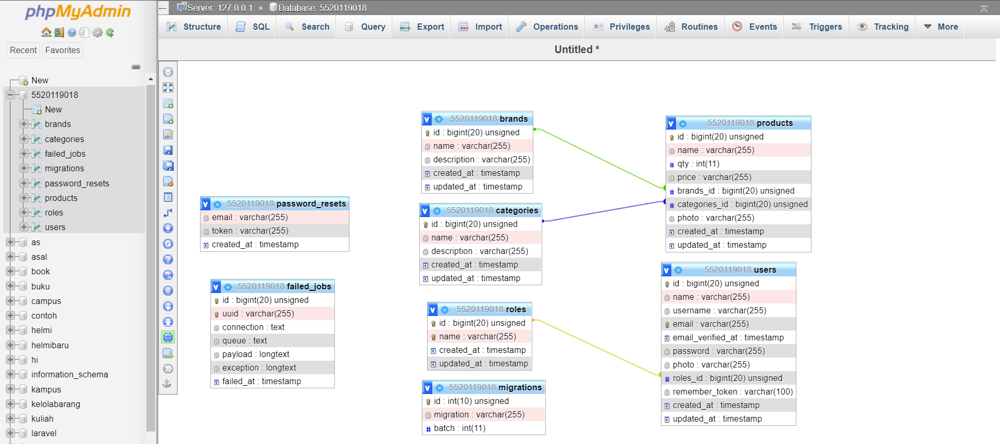
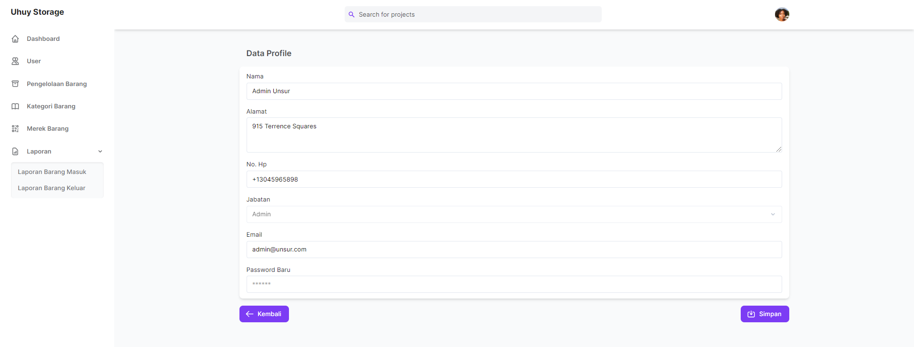

<h1 align="center">Tugas Besar PWL</h1>
<p> Enjoy the project
</p>

## PREVIEW
<p>Database</p>

<p>Login Page</p>

<p>Dashboard Page</p>

<p>User Page</p>


## Install

```sh
npm install
composer install
```
```sh

## Fix if php error  
composer self-update
composer clear-cache
rm -rf vendor
rm composer.lock
composer install --ignore-platform-reqs
```
## Usage

```sh
cp .env.example .env
php artisan key:generate
php artisan migrate:refresh --seed
php artisan storage:link
```

## Run tests

```sh
php artisan serve
```

## Account

```sh
Admin
Email    : admin@unsur.com
password : 123456
```

```sh
User
Email    : user@unsur.com
password : 123456
```

```sh
Pegawai
Email    : pegawai@unsur.com
password : 123456
```
